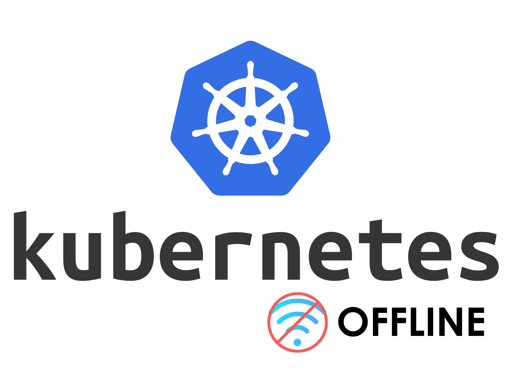

# kubernetes-offline

Benefit Kubernetes on your local Linux Ubuntu computer when on vacation ✈️

<center>
    
</center>

## Pre-requisite

- [`docker`](https://docs.docker.com/engine/install/) on source (Internet)
- [`containerd`](https://github.com/containerd/containerd/blob/main/docs/getting-started.md) on target (air-gapped) hosts
- A [GitLab server](https://docs.gitlab.com/ee/install/docker.html) or a [container registry](https://github.com/distribution/distribution) on target's network

## A. Download dependencies (online)

1. Edit env variables to match target version for Kubernetes (default to _1.27.1_)

    ```bash
    cp .env.example .env
    ```

2. Retrieve images

    ```bash
    docker-compose up --build download
    bash ./save-images.sh
    ```

## B. Load dependencies (offline)

1. Fully copy this repo with images present in `images/` and put it on your offline computer

2. Load and push images locally

    Load images without pushing (dry-run) :

    ```bash
    bash ./load-images.sh
    ```

    Optionally push them :

    ```bash
    bash ./load-images.sh -p
    ```

## C. Install Kubernetes (offline)

1. Setup an offline Kubernetes mirror

    Download the [`https://apt.kubernetes.io kubernetes-xenial main` mirror](https://github.com/flavienbwk/apt-mirror-docker/blob/master/mirror.list#L30) with [apt-mirror-docker](https://github.com/flavienbwk/apt-mirror-docker).

    Start apt-mirror-docker locally or on a remote server.

    :information_source: We recommend you to setup a full Ubuntu mirror on your offline infrastructure. You can use [the default `mirror.list` file](https://github.com/flavienbwk/apt-mirror-docker/blob/master/mirror.list) to download it.

    Append the following line to your `/etc/apt/sources.list` file :

    ```txt
    deb [arch=amd64] http://localhost:8080/apt.kubernetes.io kubernetes-xenial main
    ```

2. Install kubectl, kubectl and kubeadm

    ```bash
    sudo apt-get update && sudo apt-get install -y apt-transport-https ca-certificates curl
    sudo apt install -y kubelet=1.27.1-00 kubeadm=1.27.1-00 kubectl=1.27.1-00 containerd.io golang-docker-credential-helpers
    ```

3. Configure containerd with your private registry

    Create a local repo in GitLab. Let's put it inside `mygroup/kubernetes` for the example !

    ```bash
    read -s -p "Enter your private registry URL (ex: gitlab.my.company): " private_registry 
    read -s -p "Enter your GITLAB **username**: " username
    read -s -p "Enter your GITLAB **password**: " password

    cp ./containerd.config.example.toml ./containerd.config.toml
    docker_token=$(echo -n "$username:$password" | base64)
    sed -i "s/00000/$docker_token/g" ./containerd.config.toml
    sed -i "s/gitlab.my.company/$private_registry/g" ./containerd.config.toml
    
    # Change group and project if necessary
    sed -i "s/mygroup\/kubernetes/mygroup\/kubernetes/g" ./containerd.config.toml

    sudo mkdir -p /etc/containerd
    sudo cp ./containerd.config.toml /etc/containerd/config.toml
    sudo systemctl restart containerd
    ```

4. Install Kubernetes

    ```bash
    sudo kubeadm config images pull \
        --image-repository "$private_registry/mygroup/kubernetes" \
        --cri-socket unix:///var/run/containerd/containerd.sock \
        --kubernetes-version v1.27.1
    sudo kubeadm init --config kubeadm-config.yml
    ```

5. Configure Kubernetes' CLI and private registry secrets

    ```bash
    mkdir -p $HOME/.kube
    sudo cp /etc/kubernetes/admin.conf $HOME/.kube/config
    sudo chown $(id -u):$(id -g) $HOME/.kube/config

    kubectl create secret generic regcred --from-file=.dockerconfigjson=$HOME/.docker/config.json --type=kubernetes.io/dockerconfigjson
    kubectl create secret generic regcred --from-file=.dockerconfigjson=$HOME/.docker/config.json --type=kubernetes.io/dockerconfigjson -n kube-system
    ```

6. Configure the Flannel CNI

    ```bash
    kubectl apply -f ./images/flannel.yaml
    ```

7. Configure Ingress

    ```bash
    kubectl -n default apply -f ./images/ingress-nginx.yaml
    ```

8. Enjoy !
